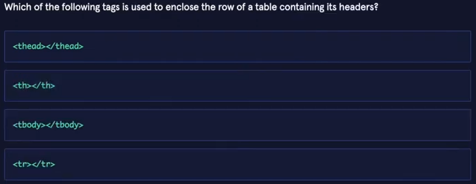

# HTML Tables Quiz
Question 1

<!-- ANSWER: C -->
Question 2

<!-- ANSWER: B -->
Question 3

<!-- ANSWER: D -->
Question 4

<!-- ANSWER: B -->
Question 5

<!-- ANSWER: A -->
Question 6

<!-- ANSWER: D -->
Question 7

<!-- ANSWER: A -->
Question 8

<!-- ANSWER: B -->
Question 9

<!-- ANSWER: B -->